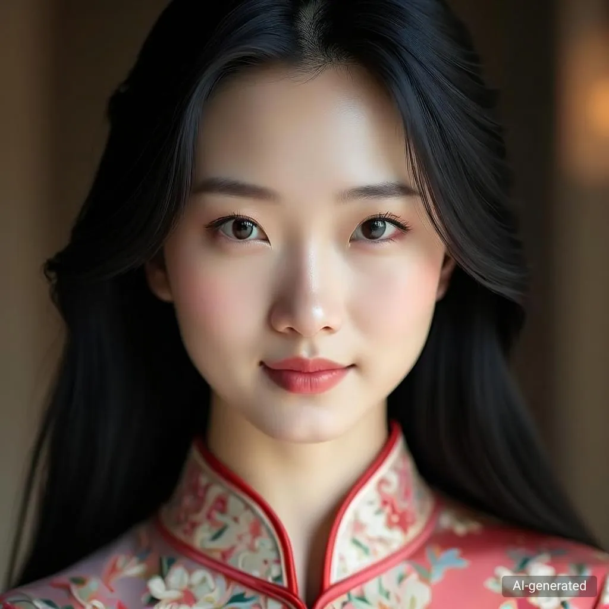

# Infinity $\infty$: Scaling Bitwise AutoRegressive Modeling for High-Resolution Image Synthesis

## 🚀 新项目版本（Chapter-5）说明

本仓库在原始 Infinity 的基础上，新增了一个面向“长尾遥感分类数据增强”的工程化子项目。  
核心目标是把“生成更多数据”升级为“生成更有用的数据”，并形成可复现实验闭环。

### 1) 新项目 Idea（双不确定性 + 多尺度闭环）

- 生成什么数据（Generate What）：用模型不确定性（熵）动态分配各类别生成预算。
- 过滤什么数据（Filter What）：用数据不确定性（多分类器的置信度/熵/分歧）筛选合成样本。
- 用什么尺度（Scale Selection）：利用 VAR 一次生成多尺度候选图像，按过滤得分自动选优保留。
- 最终目标：在相同算力预算下提升下游分类器的 `All / Head / Tail` 表现与稳健性。

### 2) 关键新增模块

- `generate_data.py`  
  生成主入口，支持：
  - `budget_mode=static|entropy_dynamic`
  - `filter_mode=full|confidence|entropy|joint`
  - `use_multiscale_candidates=1`（一次生成多尺度并自动选优）
- `scripts/run_chap5_generation.sh`  
  一键跑四组生成实验（full/confidence/entropy/joint），支持动态预算参数。
- `scripts/one_click_smoke.sh`  
  零配置一键烟雾测试（静态检查 + 自动探测路径 + 最小运行）。
- `tools/build_train_count_csv.py`  
  自动统计训练集类别样本数。
- `tools/summarize_downstream_cls.py`  
  汇总四组下游分类结果，输出每类准确率、All/Head/Tail Acc 与 Avg Acc。
- `tools/make_chap5_tables_and_plots.py`  
  自动生成论文可用表格和图（CSV/TEX/PNG）。
- `infinity/utils/downstream_metrics.py`  
  训练循环可直接调用的下游指标计算与 wandb 记录工具。

### 3) 推荐项目结构（与第5章对应）

```text
Infinity/
├── generate_data.py                              # 生成 + 过滤 + 多尺度选优 + 统计
├── scripts/
│   ├── one_click_smoke.sh                        # 一键快速验证可运行性
│   └── run_chap5_generation.sh                   # 一键跑四组生成实验
├── tools/
│   ├── build_train_count_csv.py                  # 训练集类别计数
│   ├── summarize_downstream_cls.py               # 下游分类指标汇总
│   └── make_chap5_tables_and_plots.py            # 论文图表自动生成
└── infinity/utils/downstream_metrics.py          # 训练期指标与 wandb 日志接口
```

### 4) 快速实现（Quick Start）

#### Step A: 一键检查代码可运行

```bash
cd Infinity
bash scripts/one_click_smoke.sh
```

#### Step B: 运行四组生成实验（支持动态预算 + 多尺度）

```bash
cd Infinity
export TRAIN_PATH=/path/to/DIOR/train
export TEST_PATH=/path/to/DIOR/test
export PERSONAL_DATA_PATH=/picassox/oss-picassox-train-release/segmentation/intern_segmentation/dc1
export OUTPUT_ROOT=/path/to/chap5_gen_outputs
export SFT_MODEL_PATH=/path/to/your_var_ckpt.pth
export CLASSIFIER_CKPTS=/path/cls1.pth,/path/cls2.pth,/path/cls3.pth

# 动态预算（可选）
export BUDGET_MODE=entropy_dynamic
export BUDGET_TOTAL=2000
export ENTROPY_CKPT=/path/to/entropy_classifier.pth
export USE_MULTISCALE=1

bash scripts/run_chap5_generation.sh
```

#### Step C: 汇总下游分类评测

1. 先统计训练集类别频次：

```bash
python3 tools/build_train_count_csv.py \
  --train_path /path/to/DIOR/train \
  --out_csv /path/to/chap5_cls_summary/train_count.csv
```

2. 汇总四组实验预测结果（每个 `pred.csv` 需至少包含 `y_true,y_pred` 列）：

```bash
python3 tools/summarize_downstream_cls.py \
  --train_path /path/to/DIOR/train \
  --train_count_csv /path/to/chap5_cls_summary/train_count.csv \
  --pred_csv \
    var_full=/path/to/var_full/test_pred.csv \
    var_confidence=/path/to/var_confidence/test_pred.csv \
    var_entropy=/path/to/var_entropy/test_pred.csv \
    var_joint=/path/to/var_joint/test_pred.csv \
  --out_dir /path/to/chap5_cls_summary
```

#### Step D: 自动生成论文图表

```bash
python3 tools/make_chap5_tables_and_plots.py \
  --exp_root /path/to/chap5_gen_outputs \
  --downstream_summary_csv /path/to/chap5_cls_summary/summary_metrics.csv \
  --per_class_csv /path/to/chap5_cls_summary/per_class_metrics.csv \
  --baseline_exp var_full \
  --target_exp var_joint \
  --out_dir /path/to/chap5_paper_assets
```

### 5) 主要输出文件（可直接用于论文）

- 生成阶段：
  - `generation_records.csv`：逐样本记录（是否通过、过滤原因、尺度选择、耗时等）
  - `generation_summary_per_class.csv`：类别级通过率与质量统计
  - `generation_summary.json`：全局效率统计 + 动态预算信息
- 下游汇总阶段：
  - `summary_metrics.csv`：`All/Head/Tail` 的 `Acc` 与 `Avg Acc`
  - `per_class_metrics.csv`：每类准确率（支持 tail gain 可视化）
- 图表产出阶段：
  - `tables/table_chap5_main_metrics.csv/.tex`
  - `figures/fig_budget_entropy.png`
  - `figures/fig_scale_distribution.png`
  - `figures/fig_filter_metric_box.png`
  - `figures/fig_tail_gain.png`

### 6) wandb 记录建议（下游训练阶段）

若你的训练脚本可拿到验证集 `y_true/y_pred`，可直接使用：

```python
from infinity.utils.downstream_metrics import (
    build_head_tail_split,
    compute_classification_metrics,
    log_to_wandb_if_available,
)

split = build_head_tail_split(train_counts, tail_ratio=0.5)
metrics, per_class = compute_classification_metrics(
    y_true=all_targets,
    y_pred=all_preds,
    class_ids=sorted(train_counts.keys()),
    train_counts=train_counts,
    split=split,
)
log_to_wandb_if_available(metrics, step=epoch, prefix="DownstreamEval")
```

---

<div align="center">

[](https://opensource.bytedance.com/gmpt/t2i/invite)&nbsp;
[](https://foundationvision.github.io/infinity.project/)&nbsp;
[](https://arxiv.org/abs/2412.04431)&nbsp;
[](https://huggingface.co/FoundationVision/infinity)&nbsp;
[](https://github.com/FoundationVision/Infinity)&nbsp;
[](https://replicate.com/chenxwh/infinity)&nbsp;

</div>
<p align="center" style="font-size: larger;">
  <a href="https://arxiv.org/abs/2412.04431">Infinity: Scaling Bitwise AutoRegressive Modeling for High-Resolution Image Synthesis</a>
</p>


<p align="center">

<p>

## 🔥 Updates!!

* Nov 7, 2025: 🔥 We Release our Text-to-Video generation based on VAR & Infinity, please check [Infinity⭐️](https://github.com/FoundationVision/InfinityStar).
* Jun 24, 2025: 🍉 Release a middle stage model of Infinity-8B generating 512x512 images.
* May 25, 2025: 🔥 Release Infinity Image tokenizer training code & setting, Check [Link](https://github.com/FoundationVision/BitVAE)
* Apr 24, 2025: 🔥 Infinity is accepted as CVPR 2025 Oral.
* Feb 18, 2025: 🔥 Infinity-8B Weights & Code is released!
* Feb 7, 2025: 🌺 Infinity-8B Demo is released! Check [demo](https://opensource.bytedance.com/gmpt/t2i/invite).
* Dec 24, 2024: 🔥 Training and Testing Codes && Checkpoints && Demo released!
* Dec 12, 2024: 💻 Add Project Page
* Dec 10, 2024: 🏆 Visual AutoRegressive Modeling received NeurIPS 2024 Best Paper Award.
* Dec 5, 2024: 🤗 Paper release

## 🕹️ Try and Play with Infinity!

We provide a [demo website](https://opensource.bytedance.com/gmpt/t2i/invite) for you to play with Infinity and generate images interactively. Enjoy the fun of bitwise autoregressive modeling!

We also provide [interactive_infer.ipynb](tools/interactive_infer.ipynb) and [interactive_infer_8b.ipynb](tools/interactive_infer_8b.ipynb) for you to see more technical details about Infinity-2B & Infinity-8B.

## 📑 Open-Source Plan
  - [ ] Infinity-20B Checkpoints
  - [x] Infinity Image tokenizer training code & setting
  - [x] Infinity-8B Checkpoints (512x512)
  - [x] Infinity-8B Checkpoints (1024x1024)
  - [x] Training Code 
  - [x] Web Demo 
  - [x] Inference Code
  - [x] Infinity-2B Checkpoints
  - [x] Visual Tokenizer Checkpoints


## 📖 Introduction
We present Infinity, a Bitwise Visual AutoRegressive Modeling capable of generating high-resolution and photorealistic images. Infinity redefines visual autoregressive model under a bitwise token prediction framework with an infinite-vocabulary tokenizer & classifier and bitwise self-correction. Theoretically scaling the tokenizer vocabulary size to infinity and concurrently scaling the transformer size, our method significantly unleashes powerful scaling capabilities. Infinity sets a new record for autoregressive text-to-image models, outperforming top-tier diffusion models like SD3-Medium and SDXL. Notably, Infinity surpasses SD3-Medium by improving the GenEval benchmark score from 0.62 to 0.73 and the ImageReward benchmark score from 0.87 to 0.96, achieving a win rate of 66%. Without extra optimization, Infinity generates a high-quality 1024×1024 image in 0.8 seconds, making it 2.6× faster than SD3-Medium and establishing it as the fastest text-to-image model.

### 🔥 Redefines VAR under a bitwise token prediction framework 🚀:

<p align="center">

<p>

Infinite-Vocabulary Tokenizer✨: We proposes a new bitwise multi-scale residual quantizer, which significantly reduces memory usage, enabling the training of extremely large vocabulary, e.g. $V_d = 2^{32}$ or $V_d = 2^{64}$.

Infinite-Vocabulary Classifier✨: Conventional classifier predicts $2^d$ indices. IVC predicts $d$ bits instead. Slight perturbations to near-zero values in continuous features cause a complete change of indices labels. Bit labels change subtly and still provide steady supervision. Besides, if d = 32 and h = 2048, a conventional classifier requires 8.8T parameters. IVC only requires 0.13M.

Bitwise Self-Correction✨: Teacher-forcing training in AR brings severe train-test discrepancy. It lets the transformer only refine features without recognizing and correcting mistakes. Mistakes will be propagated and amplified, finally messing up generated images. We propose Bitwise Self-Correction (BSC) to mitigate the train-test discrepancy.

### 🔥 Scaling Vocabulary benefits Reconstruction and Generation 📈:

<p align="center">

<p>

### 🔥 Discovering Scaling Laws in Infinity transformers 📈:

<p align="center">

<p>

## 🏘 Infinity Model ZOO
We provide Infinity models for you to play with, which are on <a href='https://huggingface.co/FoundationVision/infinity'></a> or can be downloaded from the following links:

### Visual Tokenizer
* Release Infinity Image tokenizer training code & setting, Check [Link](https://github.com/FoundationVision/BitVAE)

|   vocabulary    | stride |   IN-256 rFID $\downarrow$    | IN-256 PSNR $\uparrow$ | IN-512 rFID $\downarrow$ | IN-512 PSNR $\uparrow$ | HF weights🤗                                                                        |
|:----------:|:-----:|:--------:|:---------:|:-------:|:-------:|:------------------------------------------------------------------------------------|
|  $V_d=2^{16}$   |  16  |   1.22   |  20.9   |    0.31    |  22.6   | [infinity_vae_d16.pth](https://huggingface.co/FoundationVision/infinity/blob/main/infinity_vae_d16.pth) |
|  $V_d=2^{24}$   |  16  |   0.75   |  22.0   |    0.30    |  23.5   | [infinity_vae_d24.pth](https://huggingface.co/FoundationVision/infinity/blob/main/infinity_vae_d24.pth) |
|  $V_d=2^{32}$   |  16  |   0.61   |  22.7   |    0.23    |  24.4   | [infinity_vae_d32.pth](https://huggingface.co/FoundationVision/infinity/blob/main/infinity_vae_d32.pth) |
|  $V_d=2^{64}$   |  16  |   0.33   |  24.9   |     0.15     |  26.4   | [infinity_vae_d64.pth](https://huggingface.co/FoundationVision/infinity/blob/main/infinity_vae_d64.pth) |
| $V_d=2^{32}$ |  16  | 0.75 |  21.9   |     0.32     |  23.6   | [infinity_vae_d32_reg.pth](https://huggingface.co/FoundationVision/Infinity/blob/main/infinity_vae_d32reg.pth) |

### Infinity
|   model    | Resolution |   GenEval    | DPG | HPSv2.1 | HF weights🤗                                                                        |
|:----------:|:-----:|:--------:|:---------:|:-------:|:------------------------------------------------------------------------------------|
|  Infinity-2B   |  1024  |   0.69 / 0.73 $^{\dagger}$   |    83.5    |  32.2   | [infinity_2b_reg.pth](https://huggingface.co/FoundationVision/infinity/blob/main/infinity_2b_reg.pth) |
|  Infinity-8B   |  1024  |  0.79 $^{\dagger}$  |    86.6    |  -   | [infinity_8b_weights](https://huggingface.co/FoundationVision/Infinity/tree/main/infinity_8b_weights) |
|  Infinity-8B   |  512  |  -  |    -    |  -   | [infinity_8b_512x512_weights](https://huggingface.co/FoundationVision/Infinity/tree/main/infinity_8b_512x512_weights) |
|  Infinity-20B   |  1024  |  -  |    -    |  -   | [Coming Soon](TBD) |

${\dagger}$ result is tested with a [prompt rewriter](tools/prompt_rewriter.py). 

You can load these models to generate images via the codes in [interactive_infer.ipynb](tools/interactive_infer.ipynb) and [interactive_infer_8b.ipynb](tools/interactive_infer_8b.ipynb) .


## ⚽️ Installation
1. We use FlexAttention to speedup training, which requires `torch>=2.5.1`.
2. Install other pip packages via `pip3 install -r requirements.txt`.
3. Download weights from huggingface. Besides vae & transformers weights on <a href='https://huggingface.co/FoundationVision/infinity'></a>, you should also download [flan-t5-xl](https://huggingface.co/google/flan-t5-xl).
```
from transformers import T5Tokenizer, T5ForConditionalGeneration
tokenizer = T5Tokenizer.from_pretrained("google/flan-t5-xl")
model = T5ForConditionalGeneration.from_pretrained("google/flan-t5-xl")
```
These three lines will download flan-t5-xl to your ~/.cache/huggingface directory.

## 🎨 Data Preparation
The structure of the training dataset is listed as bellow. The training dataset contains a list of json files with name "[h_div_w_template1]_[num_examples].jsonl". Here [h_div_w_template] is a float number, which is the template ratio of height to width of the image. [num_examples] is the number of examples where $h/w$ is around h_div_w_template. [dataset_t2i_iterable.py](infinity/dataset/dataset_t2i_iterable.py) supports traing with >100M examples. But we have to specify the number of examples for each h/w template ratio in the filename.

  ```
  /path/to/dataset/:
    [h_div_w_template1]_[num_examples].jsonl
    [h_div_w_template2]_[num_examples].jsonl
    [h_div_w_template3]_[num_examples].jsonl
  ```

Each "[h_div_w_template1]_[num_examples].jsonl" file contains lines of dumped json item. Each json item contains the following information:
  ```
  {
    "image_path": "path/to/image, required",
    "h_div_w": "float value of h_div_w for the image, required",
    "long_caption": long caption of the image, required",
    "long_caption_type": "InternVL 2.0, required",
    "text": "short caption of the image, optional",
    "short_caption_type": "user prompt, optional"
  }
  ```

  Still have questions about the data preparation? Easy, we have provided a toy dataset with 10 images. You can prepare your dataset by referring [this](data/infinity_toy_data).


## 🧁 Training Scripts
We provide [train.sh](scripts/train.sh) for train Infinity-2B with one command
```shell
bash scripts/train.sh
```

To train Infinity with different model sizes {125M, 1B, 2B} and different {256/512/1024} resolutions, you can run the following command:
```shell
# 125M, layer12, pixel number = 256 x 256 = 0.06M Pixels
torchrun --nproc_per_node=8 --nnodes=... --node_rank=... --master_addr=... --master_port=... train.py \
  --model=layer12c4 --pn 0.06M --exp_name=infinity_125M_pn_0.06M \
# 1B, layer24, pixel number = 256 x 256 = 0.06M Pixels
torchrun --nproc_per_node=8 --nnodes=... --node_rank=... --master_addr=... --master_port=... train.py \
  --model=layer24c4 --pn 0.06M --exp_name=infinity_1B_pn_0.06M \
# 2B, layer32, pixel number = 256 x 256 = 0.06M Pixels
torchrun --nproc_per_node=8 --nnodes=... --node_rank=... --master_addr=... --master_port=... train.py \
  --model=2bc8 --pn 0.06M --exp_name=infinity_2B_pn_0.06M \
# 2B, layer32, pixel number = 512 x 512 = 0.25M Pixels
torchrun --nproc_per_node=8 --nnodes=... --node_rank=... --master_addr=... --master_port=... train.py \
  --model=2bc8 --pn 0.25M --exp_name=infinity_2B_pn_0.25M \
# 2B, layer32, pixel number = 1024 x 1024 = 1M Pixels
torchrun --nproc_per_node=8 --nnodes=... --node_rank=... --master_addr=... --master_port=... train.py \
  --model=2bc8 --pn 1M --exp_name=infinity_2B_pn_1M \
```
A folder named `local_output` will be created to save the checkpoints and logs.
You can monitor the training process by checking the logs in `local_output/log.txt` and `local_output/stdout.txt`. We highly recommend you use [wandb](https://wandb.ai/site/) for detailed logging.

If your experiment is interrupted, just rerun the command, and the training will **automatically resume** from the last checkpoint in `local_output/ckpt*.pth`.

## 🍭 Evaluation
We provide [eval.sh](scripts/eval.sh) for evaluation on various benchmarks with only one command. In particular, [eval.sh](scripts/eval.sh) supports evaluation on commonly used metrics such as [GenEval](https://github.com/djghosh13/geneval), [ImageReward](https://github.com/THUDM/ImageReward), [HPSv2.1](https://github.com/tgxs002/HPSv2), FID and Validation Loss. Please refer to [evaluation/README.md](evaluation/README.md) for more details.
```shell
bash scripts/eval.sh
```

## ✨ Fine-Tuning
Fine-tuning Infinity is quite simple where you only need to append ```--rush_resume=[infinity_2b_reg.pth]``` to [train.sh](scripts/train.sh). Note that you have to carefully set ```--pn``` for training and inference code since it decides the resolution of images.

```
--pn=0.06M  # 256x256 resolution (including other aspect ratios with same number of pixels)
--pn=0.25M  # 512x512 resolution
--pn=1M     # 1024x1024 resolution
```

After fine-tuning, you will get a checkpoint like [model_dir]/ar-ckpt-giter(xxx)K-ep(xxx)-iter(xxx)-last.pth. Note that this checkpoint cotains training states besides model weights. Inference with this model should enable ```--enable_model_cache=1``` in [eval.sh](scripts/eval.sh) or [interactive_infer.ipynb](tools/interactive_infer.ipynb).

## Use Docker

If you are interested in reproducing the paper model locally (inference only) you can refer to our Docker container. This one-stop approach is especially suitable for people with no background knowledge.

### 1. Download weights

Download `flan-t5-xl` folder, `infinity_2b_reg.pth` and `infinity_vae_d32reg.pth` files to weights folder.

### 2. Build Docker container

```
 docker build -t my-flash-attn-env .
 docker run --gpus all -it --name my-container -v {your-local-path}:/workspace my-flash-attn-env
```

### 3. Run

```
python Infinity/tools/reproduce.py
```

Note: You can also use your own prompts, just modify the prompt in `reproduce.py`.

## Infinity-8B v.s. Infinity-2B
Infinity shows strong scaling capabilities as illustrated before. Thus we are encouraged to continue to scale up the model size to larger size. Here we present the side-by-side comparison results between Infinity-2B and Infinity-8B.

| Prompt     | Infinity (# params=2B)     | Infinity (# params=8B)     |
| ------------ | -------- | -------- |
| a cat holds a sign with the text 'Diffusion is dead' |  |  |
| A beautiful Chinese woman with graceful features, close-up portrait, long flowing black hair, wearing a traditional silk cheongsam delicately embroidered with floral patterns, face softly illuminated by ambient light, serene expression    |  |  |
| a Chinese model is sitting on a train, magazine cover, clothes made of plastic, photorealistic, futuristic style, gray and green light, movie lighting, 32K HD      |  |  |
| A  group of students in a class    |  |  |

## 📖 Citation
If our work assists your research, feel free to give us a star ⭐ or cite us using:

```
@misc{Infinity,
    title={Infinity: Scaling Bitwise AutoRegressive Modeling for High-Resolution Image Synthesis}, 
    author={Jian Han and Jinlai Liu and Yi Jiang and Bin Yan and Yuqi Zhang and Zehuan Yuan and Bingyue Peng and Xiaobing Liu},
    year={2024},
    eprint={2412.04431},
    archivePrefix={arXiv},
    primaryClass={cs.CV},
    url={https://arxiv.org/abs/2412.04431}, 
}
```

```
@misc{VAR,
      title={Visual Autoregressive Modeling: Scalable Image Generation via Next-Scale Prediction}, 
      author={Keyu Tian and Yi Jiang and Zehuan Yuan and Bingyue Peng and Liwei Wang},
      year={2024},
      eprint={2404.02905},
      archivePrefix={arXiv},
      primaryClass={cs.CV},
      url={https://arxiv.org/abs/2404.02905}, 
}
```

## License
This project is licensed under the MIT License - see the [LICENSE](LICENSE) file for details.
